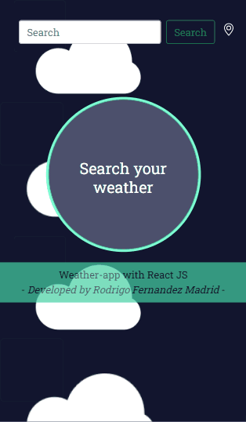

# Weather App

This project was bootstrapped with [Create React App](https://github.com/facebook/create-react-app).

## React-openweather-app — a weather forecast app written in React JS

"Weather App" is a small React JS project that makes use of the OpenWeatherMap service for fetching and displaying weather data and forecasts based on a given location (city).

## Demo
- A demo site running this little app can be found [here](https://rodrimadrid.github.io/weather-app/).
- You will also see any lint errors in the console.

# Why?

### Points of interests:

- Building an app with React js (of course!)
- Building an app based on the OpenWeatherMap API
- Bootstrapping an React js app: Basic modules and view definition
- Defining a service for fetching weather data from openweathermap.com via JSONP
- Defining a custom directive for instantly embedding sort of "weather data day panel"

